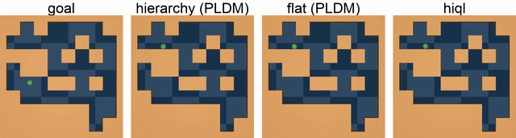
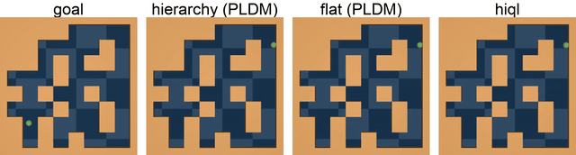
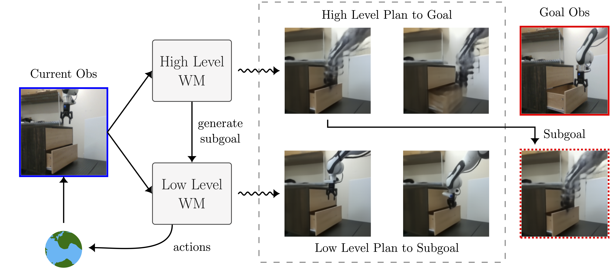
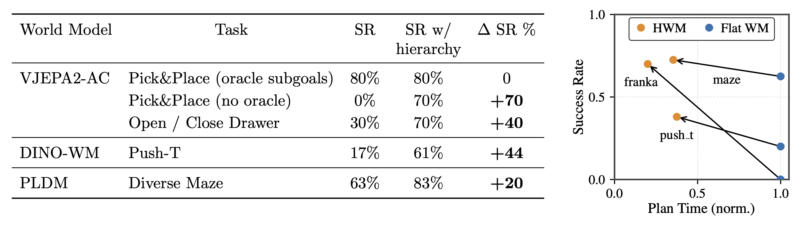

<h1 align="center"><em>Hierarchical Planning with Latent World Models</em></h1>

<p align="center">
  📄 <a href="https://arxiv.org/pdf/2604.03208">Paper</a> | 🌐 <a href="https://kevinghst.github.io/HWM/">Website</a>
</p>

<p align="center">
  <a href="https://kevinghst.github.io">Wancong Zhang</a>, <a href="https://scholar.google.com/citations?user=qUB-__0AAAAJ&hl=en">Basile Terver</a>, <a href="https://artemzholus.github.io">Artem Zholus</a>, <a href="https://soham-chitnis10.github.io">Soham Chitnis</a>, <a href="http://harsh-sutariya.github.io/">Harsh Sutaria</a>,<br/>
  <a href="https://www.midoassran.ca">Mido Assran</a>, <a href="https://www.amirbar.net">Amir Bar</a>, <a href="https://randallbalestriero.github.io">Randall Balestriero</a>, <a href="https://scholar.google.com/citations?user=SvRU8F8AAAAJ&hl=en">Adrien Bardes</a>, <a href="https://yann.lecun.org/ex/">Yann LeCun</a>*, <a href="https://scholar.google.com/citations?user=euUV4iUAAAAJ&hl=en">Nicolas Ballas</a>*
</p>


<p align="center">
  
</p>

<p align="center">
  
</p>


# Overview

- Implements **Hierarchical Planning with Latent World Models (HWM)**
- Demonstrates **long-horizon planning** in Diverse Maze (PLDM)
- Achieves higher success and lower planning cost vs flat planners

<em>Disclaimer: While HWM is evaluated across multiple world models (VJEPA2, DINO-WM, and PLDM), this repository provides a minimal implementation on PLDM (Diverse Maze). For full results across additional world models and tasks, see the [project page](https://kevinghst.github.io/HWM/) and [paper](https://arxiv.org/pdf/2604.03208).</em>

---

<p>
  Figure 1a: <strong>Hierarchical planning in latent space.</strong> A high-level planner optimizes macro-actions using a long-horizon world model to reach the goal; the first predicted latent state serves as a subgoal for a low-level planner, which optimizes primitive actions with a short-horizon world model. 
</p>
<p align="center">
  
</p>


<p>
Figure 1b: Hierarchical planning improves success on non-greedy, long-horizon tasks across multiple latent world models.
</p>
<p align="center">
  
</p>


# Repo Setup

Tested on python 3.9, CUDA 13.0

```
git clone git@github.com:kevinghst/HWM_PLDM.git

cd HWM_PLDM

conda create -n pldm python=3.9 -y

conda activate pldm

pip install -r requirements.txt

pip install -e .
```

## MuJoCo 2.1 for d4rl + mujoco-py
mkdir -p "$HOME/.mujoco"
cd "$HOME/.mujoco"
wget https://mujoco.org/download/mujoco210-linux-x86_64.tar.gz
tar -xzf mujoco210-linux-x86_64.tar.gz

## Runtime env
export MUJOCO_GL=egl
export LD_LIBRARY_PATH="$LD_LIBRARY_PATH:$HOME/.mujoco/mujoco210/bin"
export D4RL_SUPPRESS_IMPORT_ERROR=1

# Run Experiments

1. Go to `pldm_envs/`, follow instructions to set up dataset for the environment of your choice
2. Go to `pldm/`, follow instruction to run training or evaluation


# Datasets

To see the datasets we used to train our models, see folders inside pldm_envs/. The readmes there will guide you on how to download and set up the datasets
